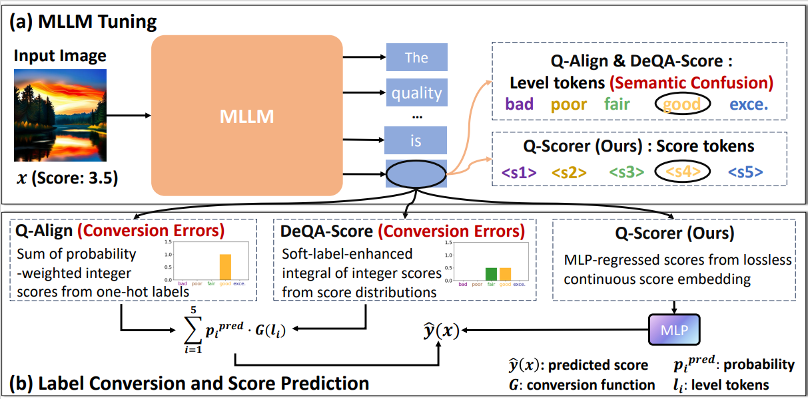
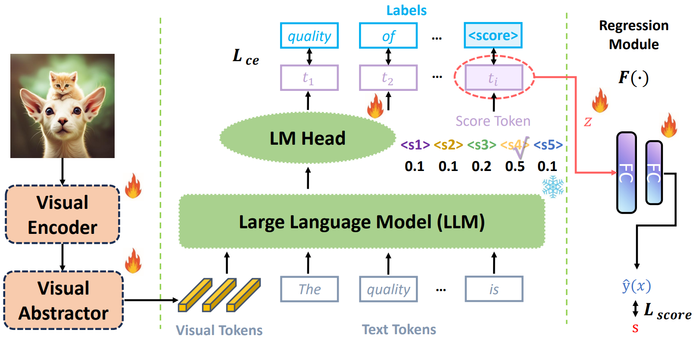

<div align="center">
  <h1>Revisiting MLLM Based Image Quality Assessment: Errors and Remedy</h1> 

<div>
    <a href="https://github.com/2kxx/" target="_blank">Zhenchen Tang</a><sup>12</sup>,
    <a href="https://songlin1998.github.io/" target="_blank">Songlin Yang</a><sup>3</sup>,
    <a href="https://scholar.google.com/citations?user=YNW7o7IAAAAJ&hl=zh-CN" target="_blank">Bo Peng</a><sup>1</sup><sup>#</sup>,
    <a href="https://github.com/wzczc/" target="_blank">Zichuan Wang</a><sup>12</sup>,
    <a href="https://scholar.google.com/citations?user=cf4RSDoAAAAJ&hl=zh-CN&oi=ao" target="_blank">Jing Dong</a><sup>1</sup><sup>#</sup>,
</div>

<div>
  <sup>1</sup>New Laboratory of Pattern Recognition, Institute of Automation, Chinese Academy of Sciences <br>
  <sup>2</sup>School of Artificial Intelligence, University of Chinese Academy of Sciences <br>
  <sup>3</sup>MMLab@HKUST, The Hong Kong University of Science and Technology  
</div>

<div><sup>#</sup>Corresponding authors.</div>

<div>
  <a href="https://github.com/2kxx/Q-Scorer/" target="_blank"><strong>Homepage</strong></a> |
  <a href="https://huggingface.co/2kxx/Qscorer_lora_5_1" target="_blank"><strong>Model Weights</strong></a> | 
  <a href="https://huggingface.co/datasets/2kxx/Q-Scorer" target="_blank"><strong>Datasets</strong></a> | 
  <a href="https://arxiv.org/abs/2511.07812" target="_blank"><strong>Paper</strong></a> 
</div>

<h2>Abstract</h2> 

<div style="width: 100%; text-align: center; margin:auto;">
      
</div>

<div style="max-width: 850px; margin: auto; font-size: 16px; line-height: 1.75; text-align: justify;">
  <p>
    The rapid progress of multi-modal large language models (MLLMs) has boosted the task of image quality assessment (IQA). 
    However, a key challenge arises from the inherent mismatch between the discrete token outputs of MLLMs and the continuous 
    nature of quality scores required by IQA tasks.
    This discrepancy significantly hinders the performance of MLLM-based IQA methods. Previous approaches that convert 
    discrete token predictions into continuous scores often suffer from conversion errors. Moreover, the semantic confusion 
    introduced by level tokens (e.g., “good”) further constrains the performance of MLLMs on IQA tasks and degrades their 
    original capabilities to related tasks.
    To tackle these problems, we provide a theoretical analysis of the errors inherent in previous approaches and, motivated 
    by this analysis, propose a simple yet effective framework, <b>Q-Scorer</b>. This framework incorporates a lightweight 
    regression module and IQA-specific score tokens into the MLLM pipeline. Extensive experiments demonstrate that Q-Scorer 
    achieves state-of-the-art performance across multiple IQA benchmarks, generalizes well to mixed datasets, and further 
    improves when combined with other methods.
  </p>
</div>

<h2>Model Architecture</h2> 

<div style="width: 100%; text-align: center; margin:auto;">
      
</div>
</div>


## Installation

If you only need to infer / evaluate:

```shell
git clone https://github.com/2kxx/Q-Scorer.git
cd Q-Scorer
pip install -e .
```

For training, you need to further install additional dependencies as follows:

```shell
pip install -e ".[train]"
pip install flash_attn --no-build-isolation
```


## Quick Assessment Start


You can quickly perform Image Quality Assessment with the following command:

```shell
python scorer.py \
  --model-path lora_path \
  --model-base model_path \
  --preprocessor-path ./preprocessor/ \
  --img_path fig/boat.jpg
 ```


## Training, Inference & Evaluation

### Datasets

<a id="datasets"></a>

- Download our meta files from [Huggingface Metas](https://huggingface.co/datasets/2kxx/Q-Scorer). 

- Download source images from [KonIQ](https://database.mmsp-kn.de/koniq-10k-database.html), 
[SPAQ](https://github.com/h4nwei/SPAQ), 
[KADID](https://database.mmsp-kn.de/kadid-10k-database.html), 
[LIVE-Wild](https://live.ece.utexas.edu/research/ChallengeDB/index.html), 
[AGIQA](https://github.com/lcysyzxdxc/AGIQA-3k-Database)
and [CSIQ](https://s2.smu.edu/~eclarson/csiq.html).

- Arrange the dataset folder Q-Scorer as follows:

```
|-- Q-Scorer
  |-- koniq
    |-- images/*.jpg
    |-- metas
  |-- spaq
    |-- images/*.jpg
    |-- metas
  |-- kadid10k
    |-- images/*.png
    |-- metas
  |-- LIVE-WILD
    |-- images/*.bmp
    |-- metas
  |-- AGIQA3K
    |-- images/*.jpg
    |-- metas
  |-- csiq
    |-- images/dst_imgs/*/*.png
    |-- metas
```

### Pretrained LoRA Weights (**_lora_path_**)

<a id="pretrained_weights"></a>

We provide LoRA fine-tuning weights with five score tokens.. 

| | Training Datasets | Weights |
|-----|-----|-----|
| LoRA Tuning | KonIQ | [Huggingface LoRA](https://huggingface.co/2kxx/Qscorer_lora_5_1) |

Download the LoRA weight, then arrange the project folders as follows:

```
|-- Q-Scorer
  |-- checkpoints
    |-- Qscorer_lora_5_1
```

You also need to download the base mPLUG-Owl2 weights from [Huggingface mPLUG-Owl2](https://huggingface.co/MAGAer13/mplug-owl2-llama2-7b), then arrange the path as **_model_path_**.

### Inference

After preparing the datasets, you can infer using pre-trained **mPLUG-Owl2** and **Q-Scorer-LoRA**:

```shell
sh scripts/infer_lora.sh $ONE_GPU_ID
```

### Evaluation

After inference, you can evaluate the inference results:

- SRCC / PLCC for quality score.

```shell
sh scripts/eval_score.sh
```


### Fine-tuning

Fine-tuning is based on the mPLUG-Owl2 weights as described in [Pretrained Weights](#pretrained_weights).

#### LoRA Fine-tuning

- Only **1 A100 GPUs** are required. Revise `--data_paths` in the training shell to load different datasets. Default training datasets are KonIQ.

```shell
sh scripts/train_lora.sh $GPU_IDs
```


## Acknowledgements

This work is based on [DeQA-Score](https://github.com/zhiyuanyou/DeQA-Score). Sincerely thanks for this awesome work.

## Citation

If you find our work useful for your research and applications, please cite using the BibTeX:

```bibtex
@inproceedings{deqa_score,
  title={Teaching Large Language Models to Regress Accurate Image Quality Scores using Score Distribution},
  author={You, Zhiyuan and Cai, Xin and Gu, Jinjin and Xue, Tianfan and Dong, Chao},
  booktitle={IEEE Conference on Computer Vision and Pattern Recognition},
  year={2025},
}
