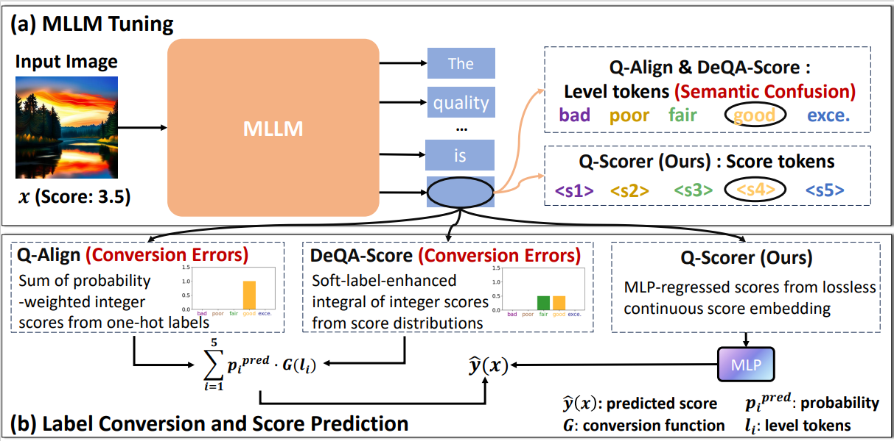
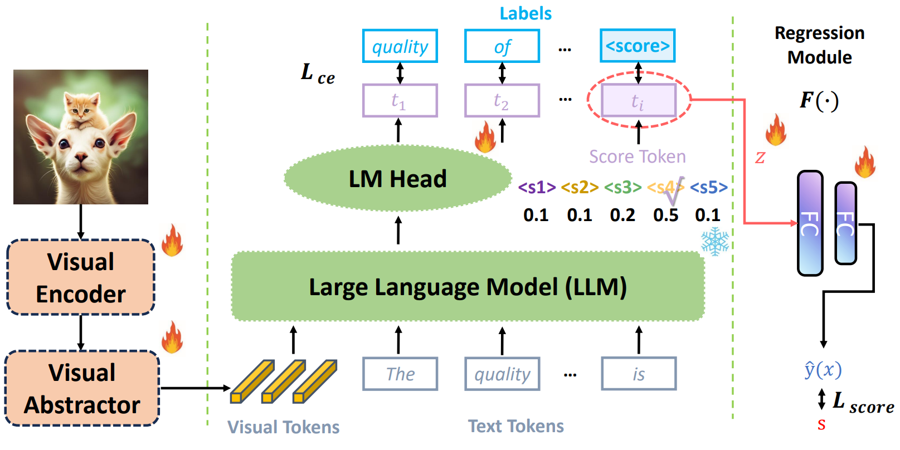

<div align="center">
  <h1>🔥[AAAI 2026] Revisiting MLLM Based Image Quality Assessment: Errors and Remedy</h1>
  <h2> Optimizing MLLM-based Scoring via a Score-Token + Decoder Paradigm</h2>
</div>

<div align="center">
    <a href="https://github.com/2kxx/" target="_blank">Zhenchen Tang</a><sup>12</sup>,
    <a href="https://songlin1998.github.io/" target="_blank">Songlin Yang</a><sup>3</sup>,
    <a href="https://scholar.google.com/citations?user=YNW7o7IAAAAJ&hl=zh-CN" target="_blank">Bo Peng</a><sup>1</sup><sup>#</sup>,
    <a href="https://github.com/wzczc/" target="_blank">Zichuan Wang</a><sup>12</sup>,
    <a href="https://scholar.google.com/citations?user=cf4RSDoAAAAJ&hl=zh-CN&oi=ao" target="_blank">Jing Dong</a><sup>1</sup><sup>#</sup>
</div>

<div align="center">
  <sup>1</sup>New Laboratory of Pattern Recognition, Institute of Automation, Chinese Academy of Sciences <br>
  <sup>2</sup>School of Artificial Intelligence, University of Chinese Academy of Sciences <br>
  <sup>3</sup>MMLab@HKUST, The Hong Kong University of Science and Technology
</div>

<div align="center"><sup>#</sup>Corresponding authors.</div>

<div align="center">
  <a href="https://github.com/2kxx/Q-Scorer/" target="_blank"><strong>Homepage</strong></a> |
  <a href="https://huggingface.co/2kxx/Qscorer_lora_5_1" target="_blank"><strong>Model Weights</strong></a> |
  <a href="https://huggingface.co/datasets/2kxx/Q-Scorer" target="_blank"><strong>Datasets</strong></a> |
  <a href="https://arxiv.org/abs/2511.07812" target="_blank"><strong>Paper</strong></a>
</div>

## Table of Contents

- [Abstract](#abstract)
- [Model Architecture](#model-architecture)
- [Benchmark Results (PLCC / SRCC)](#-benchmark-results-plcc--srcc)
- [Quick Start](#quick-start)
  - [HF AutoModel one-liner (installation-free)](#hf-automodel-one-liner-installation-free)
  - [Local `scorer.py`](#local-scorerpy)
- [Hardware Requirements](#hardware-requirements)
- [Installation](#installation)
- [Reproducing the Paper](#reproducing-the-paper)
  - [1. Download datasets](#1-download-datasets)
  - [2. Download pretrained weights](#2-download-pretrained-weights)
  - [3. Run inference](#3-run-inference)
  - [4. Compute PLCC / SRCC](#4-compute-plcc--srcc)
- [Training from Scratch](#training-from-scratch)
  - [LoRA fine-tuning](#lora-fine-tuning)
  - [Producing a merged checkpoint](#producing-a-merged-checkpoint)
  - [Publishing to HuggingFace Hub](#publishing-to-huggingface-hub)
- [Acknowledgements](#acknowledgements)
- [Citation](#citation)

## Abstract

<div align="center">
  
</div>

The rapid progress of multi-modal large language models (MLLMs) has boosted the task of image quality assessment (IQA).
However, a key challenge arises from the inherent mismatch between the discrete token outputs of MLLMs and the continuous
nature of quality scores required by IQA tasks. This discrepancy significantly hinders the performance of MLLM-based IQA
methods. Previous approaches that convert discrete token predictions into continuous scores often suffer from conversion
errors. Moreover, the semantic confusion introduced by level tokens (e.g., "good") further constrains the performance of
MLLMs on IQA tasks and degrades their original capabilities to related tasks.

To tackle these problems, we provide a theoretical analysis of the errors inherent in previous approaches and, motivated
by this analysis, propose a simple yet effective framework, **Q-Scorer**. This framework incorporates a lightweight
regression module and IQA-specific score tokens into the MLLM pipeline. Extensive experiments demonstrate that Q-Scorer
achieves state-of-the-art performance across multiple IQA benchmarks, generalizes well to mixed datasets, and further
improves when combined with other methods.

## Model Architecture

<div align="center">
  
</div>

## 📊 Benchmark Results (PLCC / SRCC)

### ⭐ MLLM-based

| Category |    Methods     | KonIQ | SPAQcr | KADIDcr | LIVE-Wildcr | AGIQA-3Kcr | CSIQcr |
|:---:|:--------------:|:---:|:---:|:---:|:---:|:---:|:---:|
| MLLM | Compare2Score  | 0.923 / 0.910 | 0.867 / 0.860 | 0.500 / 0.453 | 0.786 / 0.772 | 0.777 / 0.671 | 0.735 / 0.705 |
| MLLM |    Q-Align     | 0.941 / 0.940 | 0.886 / 0.887 | 0.674 / 0.684 | 0.853 / 0.860 | 0.772 / 0.735 | 0.785 / 0.737 |
| MLLM |   DeQA-Score   | 0.953 / 0.941 | 0.895 / 0.896 | **0.694 / 0.687** | 0.892 / 0.879 | 0.809 / 0.729 | 0.787 / 0.744 |
| MLLM | Q-Align (LoRA) | 0.932 / 0.938 | 0.874 / 0.886 | 0.624 / 0.632 | 0.858 / 0.859 | 0.806 / 0.735 | 0.772 / 0.730 |
| **🌟 Ours** |  **Ours (5)**  | **0.959 / 0.948** | **0.898 / 0.898** | 0.676 / 0.671 | 0.889 / 0.870 | **0.821 / 0.736** | **0.796 / 0.746** |
| **🌟 Ours** |  **Ours (1)**  | **0.960 / 0.950** | **0.900 / 0.899** | 0.660 / 0.645 | **0.903 / 0.888** | 0.811 / 0.722 | 0.795 / 0.733 |

> - **`Ours (k)`** denotes our model trained with `k` IQA-specific score tokens (`<score1>..<score{k}>`).
> - **`cr`** suffix marks the cross-domain setting: the published checkpoint is trained on **KonIQ only** and evaluated on the other datasets without any further fine-tuning.

## Quick Start

### HF AutoModel one-liner (installation-free)

After you produce (or download) a **merged** checkpoint, scoring an image takes a single `from_pretrained` call. **No need to `pip install` this repo**, no separate base-model download:

```python
import requests
import torch
from PIL import Image
from transformers import AutoModelForCausalLM

model = AutoModelForCausalLM.from_pretrained(
    "2kxx/Qscorer_merged",            # placeholder; see note below
    trust_remote_code=True,
    attn_implementation="eager",
    torch_dtype=torch.float16,
    device_map="auto",
)

# Single image
img = Image.open(requests.get(
    "https://raw.githubusercontent.com/2kxx/Q-Scorer/main/fig/boat.jpg",
    stream=True,
).raw)
print(model.score([img]))
# >>> [3.87]    # list[float], clamped to [0, 5], higher = better quality

# Batch (any number of PIL images at once)
paths = ["fig/boat.jpg", "fig/img_a.jpg", "fig/img_b.jpg"]
print(model.score([Image.open(p) for p in paths]))
# >>> [3.87, 2.14, 4.55]
```

> **Note**: `2kxx/Qscorer_merged` above is a placeholder. The currently published weights at [`2kxx/Qscorer_lora_5_1`](https://huggingface.co/2kxx/Qscorer_lora_5_1) are in the `LoRA + non_lora_trainables` format and **cannot** be loaded directly via `AutoModelForCausalLM`. Until a merged checkpoint is published on the Hub, replace the model id with the local output directory of [`scripts/merge_lora_save.py`](#producing-a-merged-checkpoint), or follow [Publishing to HuggingFace Hub](#publishing-to-huggingface-hub) to push your own.

### Local `scorer.py`

If you have not merged yet but already have the LoRA adapter + base model checked out locally:

```bash
python scorer.py \
  --model-path        /path/to/Qscorer_lora_5_1 \
  --model-base        /path/to/mplug-owl2-llama2-7b \
  --preprocessor-path ./preprocessor/ \
  --img_path          fig/boat.jpg
```

where `--model-path` is the downloaded `Qscorer_lora_5_1` directory (LoRA adapter + `non_lora_trainables.bin`) and `--model-base` is the downloaded `mplug-owl2-llama2-7b` directory.

## Hardware Requirements

| Task | GPU | Memory | Notes |
|---|---|---|---|
| Inference (HF AutoModel) | 1× CUDA GPU | ~16 GB (fp16) | CPU not supported |
| LoRA fine-tuning | ≥ 1× A100 (40 GB) | ~40 GB | Flash-Attention 2 strongly recommended |
| Merging LoRA → checkpoint | 1× CUDA GPU **or** CPU | ~16 GB GPU / ~30 GB host RAM | CPU works but is slow |

## Installation

If you only need to infer / evaluate:

```bash
git clone https://github.com/2kxx/Q-Scorer.git
cd Q-Scorer
pip install -e .
```

For training, you need additional dependencies:

```bash
pip install -e ".[train]"
pip install flash_attn --no-build-isolation
```

## Reproducing the Paper

### 1. Download datasets

<a id="datasets"></a>

- Download our meta files from [Huggingface Metas](https://huggingface.co/datasets/2kxx/Q-Scorer).
- Download source images from
  [KonIQ](https://database.mmsp-kn.de/koniq-10k-database.html),
  [SPAQ](https://github.com/h4nwei/SPAQ),
  [KADID](https://database.mmsp-kn.de/kadid-10k-database.html),
  [LIVE-Wild](https://live.ece.utexas.edu/research/ChallengeDB/index.html),
  [AGIQA](https://github.com/lcysyzxdxc/AGIQA-3k-Database),
  and [CSIQ](https://s2.smu.edu/~eclarson/csiq.html).

Arrange the dataset folder as follows:

```
|-- Q-Scorer
  |-- koniq
    |-- images/*.jpg
    |-- metas
  |-- spaq
    |-- images/*.jpg
    |-- metas
  |-- kadid10k
    |-- images/*.png
    |-- metas
  |-- LIVE-WILD
    |-- images/*.bmp
    |-- metas
  |-- AGIQA3K
    |-- images/*.jpg
    |-- metas
  |-- csiq
    |-- images/dst_imgs/*/*.png
    |-- metas
```

### 2. Download pretrained weights

<a id="pretrained_weights"></a>

We provide LoRA fine-tuning weights with five score tokens.

| | Training Dataset | Weights |
|-----|-----|-----|
| LoRA Tuning | KonIQ | [Huggingface LoRA](https://huggingface.co/2kxx/Qscorer_lora_5_1) |

Place the LoRA weights under `checkpoints/`:

```
|-- Q-Scorer
  |-- checkpoints
    |-- Qscorer_lora_5_1
```

You also need to download the base mPLUG-Owl2 weights from [Huggingface mPLUG-Owl2](https://huggingface.co/MAGAer13/mplug-owl2-llama2-7b); the local directory will be referenced as **`model_base`** below.

### 3. Run inference

> **Before running**, edit the placeholder paths in `scripts/infer_lora.sh`:
> - `--model-base` → your local `mplug-owl2-llama2-7b` directory
> - `--root-dir` and `--meta-paths` → the dataset root and the per-dataset meta JSON paths configured in step 1
> - `--save-dir` → where to write per-image score predictions

```bash
sh scripts/infer_lora.sh $ONE_GPU_ID     # e.g. sh scripts/infer_lora.sh 0
```

### 4. Compute PLCC / SRCC

> **Before running**, edit `gt_dir` in `scripts/eval_score.sh` to your dataset root from step 1.

```bash
sh scripts/eval_score.sh
```

## Training from Scratch

### LoRA fine-tuning

Only **1× A100 GPU** is required. Default training dataset is KonIQ.

> **Before running**, edit `scripts/train_lora.sh`:
> - `LOAD` → local `mplug-owl2-llama2-7b` directory
> - `--data_paths` → meta JSON paths (use multiple to train on a mix)
> - `--image_folder` → dataset root
> - `--output_dir` → where the LoRA adapter + `non_lora_trainables.bin` will land

```bash
sh scripts/train_lora.sh $GPU_IDs        # e.g. sh scripts/train_lora.sh "0"  or  "0,1,2,3"
```

### Producing a merged checkpoint

After training you have:

```
checkpoints/Qscorer_lora_5_1/
  ├── adapter_model.bin            # LoRA weights (PEFT format)
  ├── non_lora_trainables.bin      # lm_head + deepmlp + embed_tokens (~524 MB)
  └── adapter_config.json
```

Merge them into a **single self-contained directory** that can be loaded via the `AutoModelForCausalLM.from_pretrained(..., trust_remote_code=True)` one-liner shown in [Quick Start](#quick-start):

```bash
python scripts/merge_lora_save.py \
  --model-path        checkpoints/Qscorer_lora_5_1 \
  --model-base        /path/to/mplug-owl2-llama2-7b \
  --preprocessor-path ./preprocessor/ \
  --output-dir        checkpoints/Qscorer_merged
```

What the script does:
- merges the LoRA via `peft.PeftModel.merge_and_unload()`,
- persists `score_token_id` / `score_tokens` / `deepmlp_hidden_dims` into `config.json`,
- saves the tokenizer (with `<score1>`–`<score5>` already added) and the CLIP image processor side-by-side,
- copies the modeling `.py` files into the output dir,
- writes an `auto_map` so `trust_remote_code=True` discovers `MPLUGOwl2Config` / `MPLUGOwl2LlamaForCausalLM` automatically,
- generates a starter `MODEL_CARD.md` ready for the Hub.

Smoke-test the merged checkpoint locally:

```bash
python quick_start.py --model checkpoints/Qscorer_merged --img fig/boat.jpg
```

### Publishing to HuggingFace Hub

Once you have a merged checkpoint, upload it so anyone can use the one-liner in [Quick Start](#quick-start).

**1. Install + login**

```bash
pip install -U "huggingface_hub[cli]"
huggingface-cli login            # paste a token from https://huggingface.co/settings/tokens
```

**2. Create a repo** (either via the web UI at <https://huggingface.co/new>, or via CLI)

```bash
huggingface-cli repo create Qscorer_merged --type model
```

**3. Upload the merged folder**

`huggingface-cli upload` handles git-lfs for the weight shards automatically:

```bash
huggingface-cli upload <your-username>/Qscorer_merged \
    checkpoints/Qscorer_merged \
    . \
    --repo-type model
```

The folder uploaded must contain:

- `config.json` (with `auto_map`)
- `model-*.safetensors` (or sharded `pytorch_model-*.bin`)
- `tokenizer.json`, `tokenizer.model`, `special_tokens_map.json`, `added_tokens.json`, `tokenizer_config.json`
- `preprocessor_config.json` (CLIP image processor)
- The seven modeling files copied by the merge script:
  `modeling_mplug_owl2.py`, `configuration_mplug_owl2.py`, `modeling_llama2.py`,
  `modeling_attn_mask_utils.py`, `visual_encoder.py`, `deepmlp.py`, `utils.py`
- `MODEL_CARD.md` — rename to `README.md` on the Hub so it renders as the repo landing page.

If you prefer Python:

```python
from huggingface_hub import HfApi
api = HfApi()
api.upload_folder(
    folder_path="checkpoints/Qscorer_merged",
    repo_id="<your-username>/Qscorer_merged",
    repo_type="model",
)
```

**4. Verify**

```python
from transformers import AutoModelForCausalLM
import torch
from PIL import Image

m = AutoModelForCausalLM.from_pretrained(
    "<your-username>/Qscorer_merged",
    trust_remote_code=True,
    attn_implementation="eager",
    torch_dtype=torch.float16,
    device_map="auto",
)
print(m.score([Image.open("fig/boat.jpg")]))
```

## Acknowledgements

This work is based on [DeQA-Score](https://github.com/zhiyuanyou/DeQA-Score). Sincerely thanks for this awesome work.

## Citation

If you find our work useful for your research and applications, please cite using the BibTeX:

```bibtex
@article{tang2025revisiting,
  title={Revisiting MLLM Based Image Quality Assessment: Errors and Remedy},
  author={Tang, Zhenchen and Yang, Songlin and Peng, Bo and Wang, Zichuan and Dong, Jing},
  journal={arXiv preprint arXiv:2511.07812},
  year={2025}
}
```
